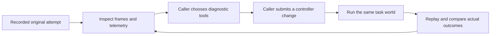

# Failure animation and replay storyboards

Status: **planned; no new animation or successful repair recording has been created**. See [scenario definitions and gates](simulator-scenarios.md) and [tool contract](simulator-tooling-contract.md).

This status describes this planning pass only. Existing-source references are pinned to initial inspection at baseline commit `803fa7f`; concurrent workspace changes are outside this document's verification.

## Shared presentation

Show one clearly labeled mission per screen. Put the physical scene first, a short objective above it, and a timeline below it. Use ordinary labels: “Original attempt,” “Candidate attempt,” “Observed result.” Show a candidate's actual failure when it fails. Until a candidate run exists, show “No candidate run yet”; never fill that slot with a nominal simulation or authored success animation.

This is the intended use of the tool layer by a future caller. The viewer itself does not perform diagnosis or write changes.

Every failed replay includes four visible checkpoints: established movement, onset of instability/error, physical failure, and aftermath. Event timing is measured. A storyboard timing target cannot schedule a stumble, impact or explosion before the relevant physical event.

Proposed recording defaults: 30 fps, at least 960×540 per view, 100 Hz telemetry, and exact command-application timestamps. Save a wide and diagnostic camera together from the same run. All cameras must contain the subject at the event, and the route/goal must remain readable in the wide view. The critical foot, package, wheel or obstacle should occupy at least 100 pixels across in its diagnostic view; verify actual visibility, not just output dimensions.

## Dog: slightly faster walk becomes a stumble

Objective text: **“Follow the faster walking command and finish the marked path.”** Proposed length: about 24–30 s, adjusted to include the slow gait cycles and measured aftermath.

| Beat | Physical action | Camera/evidence | Visible label |
|---|---|---|---|
| Establish | Settle, then complete at least two slow gait cycles at 0.12 m/s | Front-quarter wide view; all feet and floor marks visible | Requested speed and measured forward speed |
| Transition | Mission increases request to 0.15 m/s | Side view keeps feet and body in frame; small synchronized contact timeline | “Speed request increased” |
| Instability | Starter gait mistimes support/swing; toe scuffs or knees/body lose support | Slow playback around observed contact/tilt event; corresponding joint targets and encoders | “Stumble observed” only after its measured criterion |
| Outcome | Physical stumble/fall continues naturally | Wide scene plus side diagnostic view; hold final actual pose | Distance completed; speed tracking; torso contact/tilt |
| Later candidate | Same ramp/path under supplied controller | Matched camera and simulation clock | Actual completion verdict and controller version |

Use leg IDs FL/FR/RL/RR in the diagnostic UI, attached to public geometry or a legend; no red coloring of a supposedly broken limb in clean agent images. Plot observed foot contact against the candidate's planned stance/swing timing, clearly identifying the latter as controller metadata. Do not infer joint strength from a visual label.

Replay checkpoints: last stable cycle, speed transition, first measured stumble, maximum tilt, final state. A useful Astra frame batch spans before/during/after the transition rather than showing only the fallen dog. A later successful replay must retain the faster command in the overlay so reduced speed cannot masquerade as repair.

## Drone: skewed delivery load, crash, then a possible repaired mission

Objective text: **“Deliver the package from A to B, then return to A.”** Proposed mission horizon: 35–45 s; the original attempt may crash earlier.

| Beat | Physical action | Camera/evidence | Visible label |
|---|---|---|---|
| Establish | Drone at A with a visibly lateral secured package | Oblique front/underside view shows mount offset; wide view shows A, B and route | “Package loaded • Destination B” |
| Depart | Take off and begin outbound motion | Fixed side/oblique wide view against floor markings | Progress along A→B |
| Imbalance | Body rolls/pitches, differential demands saturate or remain inadequate, altitude/path diverges | Diagnostic view includes package and aircraft; rotor requests/attitude traces beside frame | Measured tilt, altitude and issued rotor commands |
| Impact | Chassis/aircraft has qualifying physical ground contact | Wide and diagnostic frames capture actual pre-contact and contact poses | “Crash observed” and measured impact time |
| Effect | Short spark/flash/smoke burst at contact site, followed by settling aftermath | Cosmetic layer, with a clean-view toggle | “Impact effect” in presentation metadata |
| Later candidate: B | Loaded transit, slow positioning, permitted latch release and actual package deposition | Close B view makes package separation/contact unambiguous | “Delivered” only after deposition criterion |
| Later candidate: A | Unloaded return and controlled arrival/landing | Wide view continuously contains both pads; inset shows package remaining at B | “Returned to A” only after terminal position/speed criterion |

The physical package must look off-center because it is off-center in the physical model. Do not fake imbalance by offsetting only the mesh. Do not substitute rotor loss for load imbalance. The original and candidate runs use identical payload and motor limits until the mission permits unloading.

The explosion is presentation only: a short impact-triggered burst, deterministic for the recorded event, no injected force, no changed mass/inertia, no generated replacement crash frames. It must not obscure the diagnostic contact frame. Preserve at least one clean pre-impact frame, the impact frame, and 2 s of aftermath. No effect on normal pad takeoff/landing contact, pure numerical failure or an arbitrarily chosen timestamp.

Replay checkpoints: mounted package, departure, first attitude-limit crossing, crash, and—only in a run that reaches them—delivery release, deposited package, return. The failure replay can leave the B/A milestones incomplete. A successful drone replay must show the load change at delivery and the resulting controller response, rather than ending at a restored hover.

## Car steering: visible drift from a fixed road

Objective text: **“Follow the lane to the finish.”** Proposed scene: 30 m course, 4 m lane, requested 4 m/s, roughly 12–15 s including approach/finish allowances.

| Beat | Physical action | Camera/evidence | Visible label |
|---|---|---|---|
| Establish | Car moves along clearly marked lane | Overhead/oblique shows centerline, boundaries and finish | Target speed and route progress |
| Drift | Steering calibration error produces actual heading/lateral deviation | Overhead retains road; front-quarter inset shows steered wheels | Issued versus measured steering; lateral/heading error |
| Departure | Body footprint crosses lane boundary; optional barrier impact follows physically | Camera remains wide enough for boundary and car | “Lane departure” at measured crossing |
| Outcome | Simulate aftermath and pause at final observed state | Desired line remains fixed; traveled trace remains visible | Route completion, max/RMS error, contact |
| Later candidate | Same car bias and route under new controller | Synchronized overhead plus wheel inset | Actual completion and lane metrics |

Draw actual path only from recorded pose. A lane-centerline overlay cannot move to follow the candidate. Distinguish wheel/rack angle from steering command rather than displaying one as both. If the task uses an initial damaged fixture, explain that setup in the task card; do not insert an unexplained recovery teleport into continuous road footage.

Replay checkpoints: first steering pulse/correction, first sustained lateral deviation, footprint crossing, closest obstacle approach/contact, finish or final failure state.

## Car braking: late response and real collision

Objective text: **“Approach at speed, detect the obstacle, and stop with clearance.”** Proposed initial calibration: 12 m/s, roughly 25 m available gap; final values depend on measured braking authority.

| Beat | Physical action | Camera/evidence | Visible label |
|---|---|---|---|
| Establish | Car approaches; obstacle visible in scene | Side-wide includes car and obstacle; chase inset | Speed, front-bumper gap, detection/range validity |
| Response | Starter brakes late or modulates poorly | Brake-command bar synchronized with wheel speeds and motion | Actual brake onset; current deceleration |
| Impact | Car collision geometry contacts obstacle with nonzero approach speed | Preserve uncut side view through contact | “Collision observed”; impact speed |
| Outcome | Aftermath/actual final state | Gap line anchored to front bumper and obstacle, not chassis center | Collision; censored stopping distance |
| Later candidate | Same approach and obstacle, earlier/effective brake actuation | Same cameras/timeline; actual command bar | Sustained stop and measured clearance |

Range is a declared simulated sensor, not a claim that the agent extracted depth from RGB. The clean frames still provide physical context and corroborate motion. Optional time-to-contact or estimated stopping envelope is labeled derived/estimated and is computed only from public signals/candidate estimates, never hidden true brake capacity.

Replay checkpoints: range first valid, brake onset, peak observed deceleration, collision or sustained stop, final clearance. A wall-free stopping probe is a separate labeled experiment and cannot replace the collided trial in the replay.

## Playback and comparison contract

Reuse existing Space/C/+/- controls (`simulator/view_controls.py:118`, `simulator/DEMO_GUIDE.md:63`), then add saved-run behavior deliberately:

| Control | Recorded replay behavior |
|---|---|
| Play/pause, restart | Read saved samples/frames; never run physics or reset the world |
| Timeline seek and previous/next frame | Select an existing timestamp; display actual sample time |
| Speed 0.25× / 0.5× / 1× / 2× | Change playback pacing only |
| Camera selection | Choose captured view, or a separately verified saved-state rendering |
| Event jump | Jump to recorded observable event with configurable pre-roll |
| Overlay toggle | Clean RGB, public diagnostics, or explicitly operator-only explanation |
| Compare | Lock camera, simulation clock, and axis scales for matched attempts |
| Rerun experiment | Separate explicit action; creates a new run ID and reset receipt |

The current native R/N controls rerun/reset physics; document their difference from recorded replay instead of quietly changing their behavior. A slider or frame-step action is new UI work, not something already delivered by the existing viewer.

Default comparison alignment is trial simulation time. Optionally align to a public event such as speed transition or brake onset, with the offset shown; do not use a timeline warp that makes different speeds look equal. If one run ends earlier, hold its final frame with “Run ended at …” while the other continues. No fabricated continuation and no interpolation across a reset or collision discontinuity.

Comparison labels bind to controller hash and world/start fingerprint. Highlight mismatches before presenting metric deltas. A “Candidate attempt” badge means the supplied candidate executed; “Task completed” requires the mission criteria. Neither means Astra authored it unless an external transcript establishes authorship.

## Artifact and reconstruction requirements

Extend the existing public `observations.jsonl`, `frames.jsonl`, frames and summary convention (`simulator/recording.py:97`). Proposed additional artifacts:

- Public run manifest with versions/fingerprints, source provenance, sensor/control rates, camera list, actual capture times, event index, completeness and mission status.
- Per-camera frame files/indexes; exact applied command history; public telemetry; immutable actual summary.
- Recorded replay manifest and optional portable video. MP4 is optional when an encoder already exists; lack of an encoder must not block PNG/timeline replay or introduce a dependency silently.
- Comparison manifest linking original and candidate runs, compatibility checks, alignment offsets and derived metrics.
- Host-only restart/render state sufficient for exact reconstruction: model changes, attachments, joint/body state, controller state, pending events, actuator histories and engine version. `qpos` alone is insufficient for a delayed motor, thermal state or released payload.

Preferred replay source is immutable captured frames. If an additional camera is rendered later, restore the saved visual/physical state and verify source provenance; if a full rerun is required, label it as such and compare recorded trajectories/events before accepting derived footage. Existing dashboard replay validates outcomes for the braking workstream (`dashboard/media.py:48`); new multiplatform replay must not assume that implementation covers it.

Public artifacts use non-revealing task IDs and contain no hidden diagnostic overlays. Host-only reconstruction snapshots do not enter the agent bundle. All media has an origin marker identifying MuJoCo capture, derived plot/overlay, or cosmetic effect. AI-generated illustrations cannot replace simulation frames.

## Visual verification checklist for later implementation

- Each mission's objective and failure are understandable from its wide view; its diagnostic view reveals the relevant limb/package/wheel/gap.
- Inspect four required checkpoints for every original attempt, and any later candidate's actual finish/failure. No occluded decisive contact or clipped robot.
- Frame and telemetry times agree within one frame; critical events have a frame before and after.
- Speed/camera/replay/effect changes leave physical state, commands and scores unchanged.
- Crash effect is gated by a qualifying physical contact and absent from harmless landings/numerical failures.
- Replay to completion, seek backward, change camera, and replay again without physics calls or changed artifact hashes.
- Compare unequal-duration attempts without hiding an early failure. Test missing camera, missing frames and partial recordings with clear messages.
- Run `$visual-verdict` on rendered outputs before subsequent visual edits; save verdict JSON and evidence paths under the scope named in the main plan. No visual verdict is claimed for this text-only planning pass.
