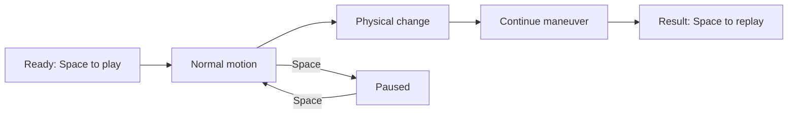

# Clear motion and common demo controls

Status: implemented and verified, 2026-09-10. Scope includes car, robot dog,
warehouse robot and drone; rocket remains excluded per user instruction.

## User outcome

Open a presentation preset, click the viewer, press Space once, and watch the
whole physical scenario. Drone motion must be visibly lateral, not just hover
followed by a drop. Controls and status should be visible inside the window.

## Visual sequence

Drone presentation target (calibrate rather than invent outcomes):

| Time | Motion | Visible explanation |
|---|---|---|
| 0–2 s | Settle at hover | Ready/normal flight; flight route visible |
| 2–8 s | Travel several metres to the right and climb | Transit; position changes before any fault |
| 8–12 s | Moderate rotor loss; continue across the course | Cross-course; observe tracking/attitude change |
| 12–18 s | Return toward origin | Return; residual remains visible |
| 18–20 s | Settle at hover | Result; no fictitious autonomous repair |

The actual timings and route will be documented after calibration. A healthy
control follows the identical route. Severe existing failure presets stay
available and keep their calibrated physics.

## Common controls and levers

- Space: start, pause/resume, replay after completion. R: retain damage and
  repeat. N: reset/replay the configured full experiment. Escape: close.
- C: cycle useful cameras; +/-: adjust playback speed only (not physics dt).
- `view --camera chase|side|overview|free`, `--speedup`, `--autoplay`.
- `--set NAME=VALUE` accepts validated JSON parameter overrides for each model,
  including motor effectiveness, leg strength, payload, onset and probe settings.
  Explicit named CLI flags override --set, which overrides config/preset values.
- Curated `drone_demo`, `quadruped_demo`, `warehouse_demo`, `car_demo` presets
  provide visible, physically calibrated motion. Existing presets are unchanged.
- On-screen status: scenario, Ready/Playing/Paused/Complete, phase, simulation
  time/duration, playback multiplier, camera, and concise relevant settings.
  Diagnostic/private settings belong only to the trusted operator's viewer;
  Recorder public observations and normal agent-facing frames remain unchanged.

## Implementation ownership

- Drone agent: additive showcase probe/preset in simulator/platforms/drone.py,
  drone visual MJCF and focused tests/test_drone_showcase.py. Preserve old presets.
- Other-platform agent: additive showcase presets in car_damage.py, quadruped.py,
  warehouse.py and tests/test_showcase_profiles.py. Preserve old presets/physics.
- Parent: simulator/view_controls.py, CLI/recorded-viewer integration, config
  overrides, playback tests, visual verification, docs and launch script.
- Previous platform workstream is complete; preserve its tested core and contracts.

## Acceptance and verification

- Drone healthy showcase travels at least 2 m laterally before its fault time;
  moderate showcase stays airborne through the full requested route with finite
  state and zero MuJoCo warnings. Tests report tracking error honestly.
- Other showcase presets complete with finite states/no warnings and visibly
  change motion under their declared fault. No synthetic position forcing.
- Playback still uses one window/model/data across replay; camera/speed changes
  never alter simulation dt or the physical trajectory for a fixed command history.
- All settings reject invalid values before execution; precedence is tested.
- Existing car component comparison and lab recording commands keep working.
- Regression tests, lint, mypy, selected live-window checks and rendered HUD/scene
  inspection pass. Visual verdicts saved under .omx/state/demo-controls-visual/.
- Guide includes one command per demo, per-platform parameter names/units/ranges,
  expected phases and limitations. All labels distinguish simulation failure
  from inference or autonomous model repair, which remain outside this viewer.

## Integration notes

The parallel platform workstream updated quadruped_demo to a deliberate 8%
knee-output collapse and physical aftermath; that newer change and its tests
were preserved. Use strength=0.6 for the previously calibrated upright variant.

Native HUD verification exposed display-refresh throttling. Shared viewers now
advance bounded batches of due physics steps and measure refresh intervals after
render completion. Camera/speed controls and two complete20s drone runs passed
in one real macOS window with identical final states and zero ground contacts.

Final verification:211 pytest tests +554 subtests passed; final UI regression21
tests +32 subtests passed. Ruff/mypy passed. Rendered visual QA scored93/pass.
Guide: simulator/DEMO_GUIDE.md. Full test log:/tmp/presentation-demos-full-tests.log.
