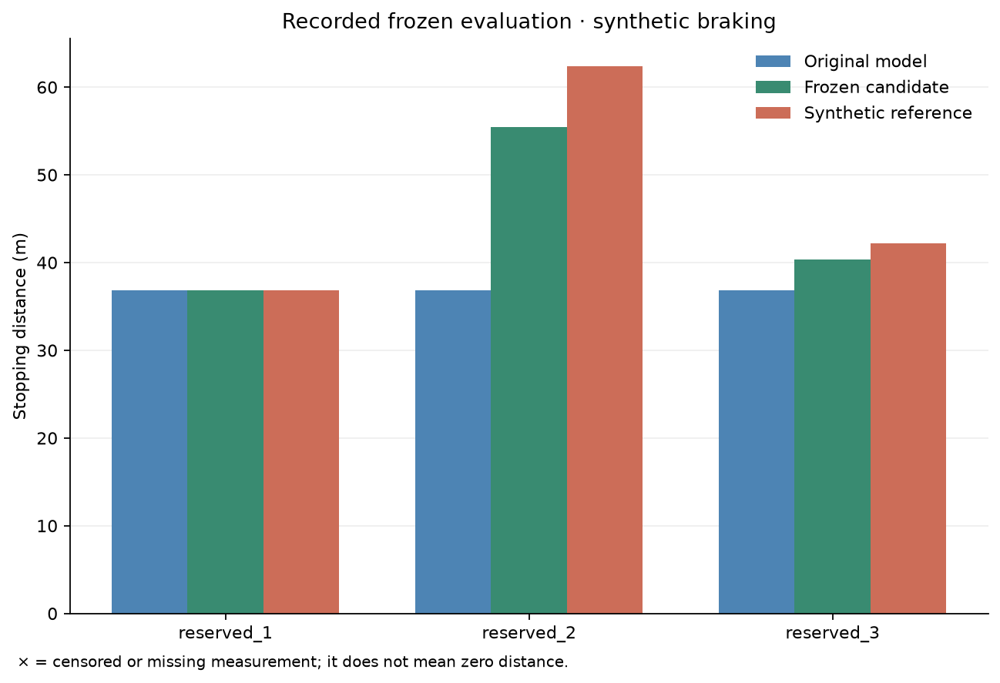

# First Astra / medium car experiment — 10 September 2026

**Astra authored an executable state extension and reduced reserved-case mean error by 71.5%, but failed the full predeclared prediction criteria.** This is a useful partial result, not a fully correct repair.

OpenAI returned `gpt-6-astra` and `reasoning.effort=medium` on all 12 investigation requests. The run took 8 minutes 28 seconds, using the single local `OPENAI_API_KEY`. Sol was not used. The API key, private reference implementation, and developer-written solution were not included in the remote model's context.

## What Astra did and why

The initial car model had fixed brake capacities and no memory. At 25 m/s, the measured fresh stop was 47.51 m, while four braking cycles increased it to 104.81 m. The original model predicted about 47.50 m in both cases.

Astra proposed reversible heat-related fade and persistent wear as competing explanations. It chose three new measured experiments:

| Experiment | Astra's stated purpose | Measured stop |
| --- | --- | ---: |
| Four cycles, then 120 s rest, at 25 m/s | Distinguish recovery from lasting wear | 51.57 m |
| One cycle, no rest, at 25 m/s | Examine the transition into weakening braking | 55.13 m |
| Fresh stop at 30 m/s | Check whether braking work, rather than cycle count, drives weakening | 69.19 m |

It inspected each trajectory, then added four persistent `heat_j` values. Each accumulates energy from the component's own applied torque and wheel speed, decays with a 90-second time constant, and reduces available brake torque through a bounded smooth curve. Repositioning preserves the state. The original cold capacities remain unchanged. The energy scale is an inferred effective parameter, not a measured physical temperature.

Its first diff was rejected for incorrect hunk line counts. Astra corrected the diff itself; the accepted source is preserved byte-for-byte in [actuator.py](actuator.py), with the [source diff](source.diff). No human changed this candidate. It executes in the isolated Python worker coupled to the four-wheel MuJoCo car; the engine was not rewritten.

The development suite retained the fresh stop and reduced the four-cycle error from 57.31 m to 0.52 m. Further model checks underestimated the one-cycle stop by 2.65 m and the 120-second recovery stop by 1.61 m. The development suite compares against the original baseline; it does not yet track regressions against every earlier repair.

## Was it correct on new inputs?

The host froze the code and parameters, saved all original and candidate predictions, then revealed the three reserved reference probe outcomes. None of these complete input configurations had been observed during the investigation. Each rollout evolved its own state while replaying the permitted preparation commands.

| Trial at 22 m/s | Original prediction | Astra prediction | Measured stop | Astra error | Check |
| --- | ---: | ---: | ---: | ---: | --- |
| Fresh | 36.88 m | 36.88 m | 36.88 m | 0.00 m | Pass |
| Two preparation cycles | 36.88 m | 55.48 m | 62.40 m | 6.92 m | Fail |
| Two cycles + 45 s rest | 36.88 m | 40.35 m | 42.22 m | 1.87 m | Pass |

Mean absolute stopping-distance error fell from **10.29 m to 2.93 m**. The fresh control remained exact. The two-cycle case missed by **6.92 m**, exceeding its predeclared 10% tolerance of **6.24 m**. Therefore the aggregate-improvement check passed while the complete prediction verdict failed. The reserved results were not used to alter the frozen candidate or rerun until success.



The chart's `reserved_1`, `reserved_2`, and `reserved_3` correspond to the three rows above. Full numerical criteria, source indicators, timestamps and metrics are in [results.json](results.json).

## What remains uncertain

This was one synthetic investigation with three reserved stopping tests, all at full brake strength without a wall. Matching non-collision outcomes does not validate crash prediction. The repair still underestimates intermediate brake fade; the observations support a work-dependent recoverable state without identifying unique physical parameters. We have not compared it with a fitted parameter-only baseline on this four-wheel benchmark, tested other failures, run Sol, or established research novelty.

The agent did **not** explicitly call `submit_prediction`: it used the 12-request budget on investigation and validation, and the host froze its latest accepted source. The original task disclosed the larger tool budgets but omitted this tighter API-request cap, a harness limitation rather than evidence that Astra chose to stop. There was no post-evaluation Astra debrief because no requests remained. Future sessions now show the API-request budget and a submission reminder; this interface fix does not change the recorded pilot or its result.

## Prompts, evidence and next run

The prompt templates are [system.md](../../investigation/prompts/system.md) and [task.md](../../investigation/prompts/task.md). They require competing hypotheses, expected observations before experiments, short public explanations, executable component edits and validation. Exact messages sent in this pilot, including initial measurements and the neutral contract, are saved locally under `runs/astra-medium-pilot-20260910/prompts/`. The local `report.md` in that run folder contains the complete readable activity log and links to full trajectories. Those raw run artifacts remain ignored by Git; this folder is the compact shared record.

To start another independent API investigation:

```sh
.venv/bin/python -m investigation
```

For the next iteration, use the one-cycle and recovery development observations to test fade-curve parameters before freezing. Treat the now-revealed reserved cases as development knowledge for any follow-up informed by this report; predeclare new evaluation histories for a new generalization claim. Keep the incomplete `candidate/wheel_actuator.py` as the starting point for fresh investigations.

Frozen source SHA-256: `bd6ad5d9d5eef3920c05dee2e7d8631fbf3463fa807908fb706c3b205fcf4761`. Recorded API usage: 750,349 input tokens (665,845 cached), 3,290 output tokens, including 1,338 reasoning tokens. These are token counts, not a billing estimate.
