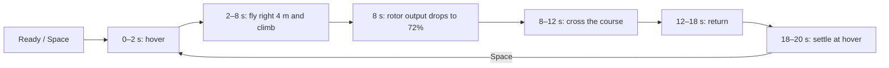

# Presentation demos: press Space once

Close any old viewer window, then run:

```sh
.venv/bin/mjpython -m simulator view drone_demo
```

Click inside the viewer and press **Space once**. It runs the entire 20-second
flight. Double-clicking `launch_simulator.command` now opens this drone demo too.
The script also forwards parameters, for example:
`./launch_simulator.command drone_demo --speedup 0.5`.

## Drone: visible motion before the change



The floor pads and connecting lines show the intended route. The stationary side
camera makes world +x appear to the right. The drone travels about 3.5 m before
the change and about 10 m overall. It stays airborne with the shipped moderate
fault, but settles away from the intended hover position. This shows a stale
model/controller's tracking error; it does not claim Astra has repaired anything.
The original severe `drone_rotor_loss` crash scenario remains unchanged.

The overlay shows Ready/Playing/Paused/Complete, motion phase, time, progress,
playback speed, camera, physical settings and position. These are operator
presentation overlays; normal public recordings still exclude private settings.
The overlay also shows the most recent physical event and its time, followed by
the measured outcome when the run finishes. The warehouse latch failure leaves
the robot upright; the drone's tracking failure leaves it airborne.

## One command per demo

Run one at a time, or use `python -m simulator demos` to list launch commands.

| Demo | Launch argument after `view` | What happens |
|---|---|---|
| Drone | `drone_demo` | Fly right, climb, cross the course after moderate rotor loss, return to hover |
| Car | `car_demo` | Approach a barrier, physically impact it, reposition, then inspect changed steering/braking |
| Robot dog | `quadruped_demo` | Walk about a metre, lose one knee's support, stumble, fall, and simulate the aftermath |
| Warehouse | `warehouse_demo` | Drive with cargo, turn, release the cargo latch, continue with shifted mass |

```sh
.venv/bin/mjpython -m simulator view car_demo
.venv/bin/mjpython -m simulator view quadruped_demo
.venv/bin/mjpython -m simulator view warehouse_demo
```

The original four-wheel car presets, such as `baseline`, `brake_fade`, and
`wheel_loss`, use the same playback controls. The separate recorded-car viewer
(`python -m sim.cli view FILE`) also supports Space, R/N, C, +/- and Escape.
Rocket is excluded as requested.

## Controls inside the window

| Control | Action |
|---|---|
| Space | Start; pause/resume; replay from the beginning after completion |
| N | Restart and play the full configured scenario |
| R | Repeat while retaining completed physical damage; recorded replay restarts its saved trace |
| C | Cycle chase, side, overview and free cameras available for the model |
| − / + | Decrease/increase playback speed through 0.125×, 0.25×, 0.5×, 1×, 2×, 4×, 8× |
| Escape | Close |

Speed controls change wall-clock pacing, never the integration timestep or force
commands. Replays reuse the same window/model/data so macOS does not encounter
the old close/reopen race. In free view, MuJoCo mouse controls rotate and zoom.
Recorded-car cameras cycle fitted free, side and overview views.

## Starting settings

```sh
# Slower playback, with the complete route in view.
.venv/bin/mjpython -m simulator view drone_demo --camera side --speedup 0.5

# Start immediately; show advanced MuJoCo panels only if wanted.
.venv/bin/mjpython -m simulator view drone_demo --autoplay --native-ui

# Change physical/maneuver settings before starting.
.venv/bin/mjpython -m simulator view drone_demo \
  --set flight_distance=5 --set rotor_effectiveness=0.8 --fault-at 9

# Healthy control: identical route with no injected fault.
.venv/bin/mjpython -m simulator view drone_demo --set fault=healthy
```

Use repeated `--set NAME=VALUE` settings. Numbers, booleans and lists use JSON;
simple strings such as `--set probe=showcase` do not require embedded quotes.
The platform validates names and ranges before execution. Precedence is:
**preset → config file → --set → explicit named flags**. `--set` also works with
`run`, `compare`, and the timed-intervention lab.

A settings change applies when launching the run; C and +/- are live controls.
Use the shipped 20-second duration for the complete drone route. A shorter
`--duration` intentionally truncates it. Changing `--timestep` changes numerical
integration and is a validation setting, not a playback-speed control.

## Physical levers by demo

| Demo | Setting | Shipped value | Accepted range / meaning |
|---|---|---:|---|
| Drone | `flight_distance` | 4 m | 2–8 m outbound route distance |
| Drone | `flight_altitude` | 2.8 m | 2–3.2 m cruise altitude |
| Drone | `rotor_effectiveness` | 0.72 | 0–1 remaining thrust multiplier of the affected rotor |
| Drone | `rotor_index` | 0 | 0–3; front-left, front-right, rear-right, rear-left |
| Drone | `fault_at` | 8 s | Physical change time; `--fault-at` is equivalent |
| Car | `impact_speed` | 4.5 m/s | 0–15 m/s approach |
| Car | `barrier_x` | 14 m | 5–100 m barrier position |
| Car | `steering_gain` | 0.65 | 0–1.5 steering response after damage |
| Car | `steering_bias` | 0.06 rad | −0.3–0.3 rad |
| Car | `probe_speed` | 4 m/s | 0–12 m/s inspection |
| Car | `fault_at` | 1 s | Arms impact detection; damage still requires a physical collision |
| Dog | `speed` | 0.12 m/s | −0.15–0.2 m/s command |
| Dog | `strength` | 0.08 | 0–1 remaining knee torque |
| Dog | `affected_leg` | FL | FL, FR, RL, RR |
| Dog | `gait_period` | 3.2 s | 2–6 s |
| Dog | `fault_at` | 9 s | Weakness onset |
| Warehouse | `payload_mass` | 16 kg | 0.1–30 kg loaded before the run |
| Warehouse | `shift_distance` | 0.28 m | 0–0.3 m physical cargo travel |
| Warehouse | `fault_at` | 3.2 s | Cargo latch release |
| Warehouse | `probe` | validation | straight, turn, pulses, validation |

Examples:

```sh
.venv/bin/mjpython -m simulator view car_demo --set steering_bias=0.09
.venv/bin/mjpython -m simulator view quadruped_demo --set strength=0.75 --set speed=0.1
.venv/bin/mjpython -m simulator view warehouse_demo --set payload_mass=12 --set shift_distance=0.2
```

Other fault families retain their own applicable levers: drone `voltage_ratio`,
`wind_force`, `payload_mass`, `control_delay`; dog `foot_friction` and joint damage;
warehouse `resistance`, `motor_scale` and `traction_scale`; original car `--speed`,
`--brake`, `--cycles`, `--rest` and `--config`. Settings for inactive fault families
do not alter that run, and are omitted from its on-screen settings summary.

Only the shipped combinations are calibrated presentation presets; accepted
individual ranges do not guarantee every combination remains upright or airborne.
The dog walks about 1.06 m before knee output drops to 8% at 9 s. It physically
falls around 13.7 s and continues through 18 s; use `--set strength=0.6` for the
milder upright variant. Moderate failures can exceed tracking/gait limits
without falling.

## Evidence

The visual plan is `.omx/plans/visual-demo-controls.md`. Preview frames and visual
verdicts are in `runs/demo-controls-visual*` and `.omx/state/demo-controls-visual/`.
Focused tests cover the showcase routes, old presets, settings precedence,
validation, unchanged physics under camera/speed controls, and single-window replay.
The four-demo motion, deterministic replay, and half-timestep validation report
is `runs/scenario-motion-validation/report.md`. Walking, failure, and final-state
frames are in `runs/scenario-motion-visual/`.

Latest checks: the native macOS viewer completed and replayed the full 20-second
drone course while C/+/- changed camera and playback speed. The two runs ended
at identical states with zero ground contacts. Final position was approximately
(0.613, 0.595, 1.795) m against the intended (0,0,2) m hover; maximum tracking
error was 1.588 m. The result is airborne with a meaningful model mismatch.
The final controls regression passed 21 tests and 32 subtests. Ruff and mypy
(23 source files) passed. Visual checks passed for all four demos.

Full integration verification: **211 tests and 554 subtests passed** in the
locked Python3.12 environment. Log: `/tmp/presentation-demos-full-tests.log`.
